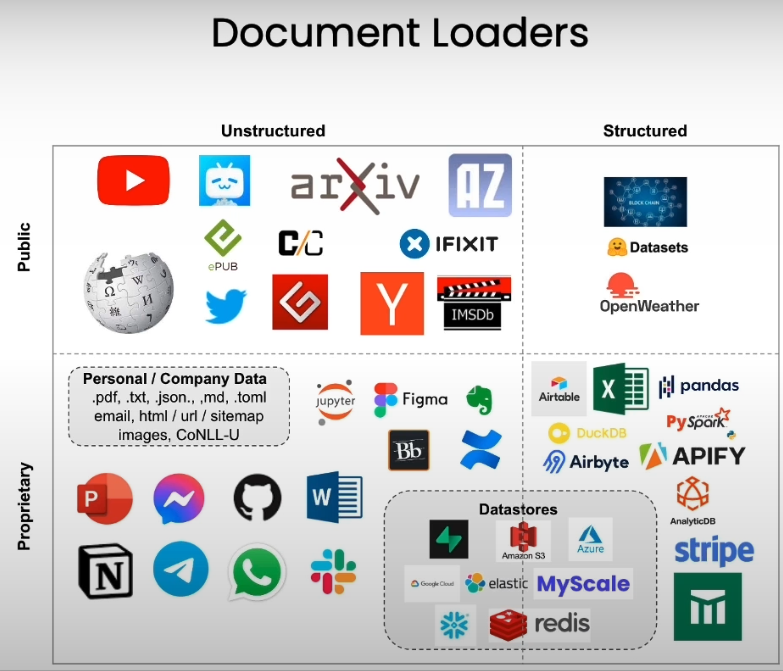

# Document Loading
in order to create an application where you can chat with your data, you first have to load your data into a format where it can be worked with. That's where LangChain document loaders come into play.

##
# Loaders
- Loaders deal with the specifics of accessing and converting data
- - Accessing
* - - web sites
* - - Data bases
* - - YouTube
* - - arXiv
* - - ...
- - Data types
* - -  PDF
* - - HTML
* - - JSON
* - - Word, PowerPoint...

- Returns a list of `Document` objects: 

[
   Document(page_content='MachineLearning-Lecture01\nInstructor(Andrew Ng): Okay. Gooad morning.  welcome to CS229...',
   metadata={'source':'docs/cs229_lectures/MachineLearning-Lecture01.pdf', 'page':0})

   ...
    Document(page_contant='[End of Audio] \nDuration: 69 minutes',
   metadata={'source':'docs/cs229_lectures/MachineLearning-Lecture01.pdf', 'page':21})

]

whole purpose of document loaders is to take this varity of data sources and load them into a standard document object. which consists of content and then associated metadata. There are a lot of different type of document loaders in LangChain.
