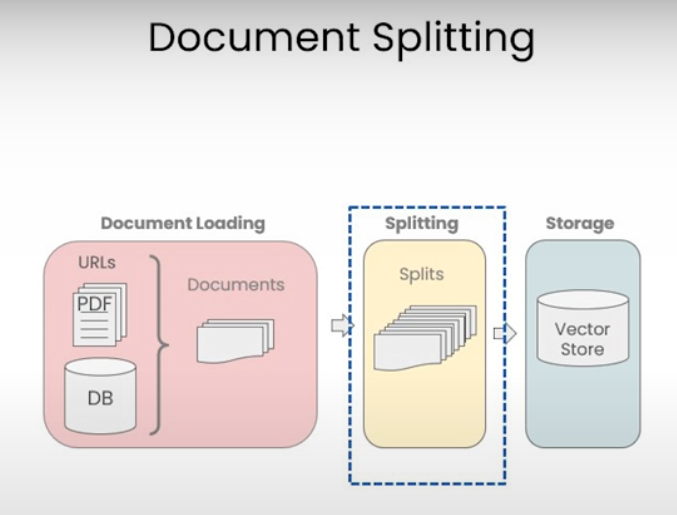

# Document Spliting

#
DOcument spliting happens after you load your data into the document format. But before, it goes into the vector store, and this may seem really simple.

you can just split the chunks according to the lengths of each character or something like that.

But as an example of why this is both trickier and very important down the line? 

-- let's take a look at this example here. 

```md
...
on this mode. The Toyota Camry has a head-snapping 80 HP and an eight-speed automatic transmission that will
...

`chunk 1:`on this model. The Toyata Camry has a head-snapping

`chunk 2:` 80 HP and an eight-speed automatic transmission that will.

Question: what are the specification on the Camry?
```