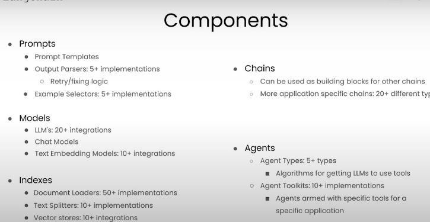
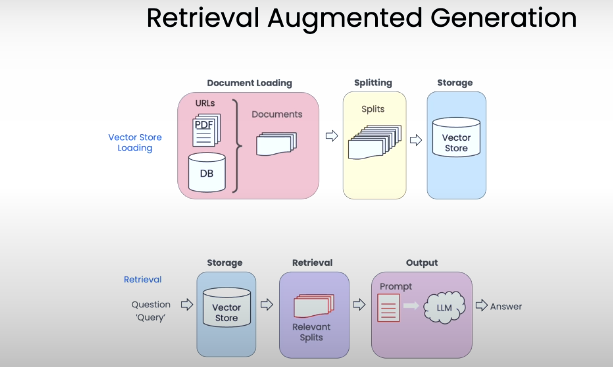

# LangChain

- LangChain to chat with your data. LangChain is an open-source developer framework for building LLM application.
- Langchain consist of several modular components as well as more end-to-end templates. The modular components in LangChain includes prompts, models, indexes, chains and agent.

# Retrieval Augmented Generation

